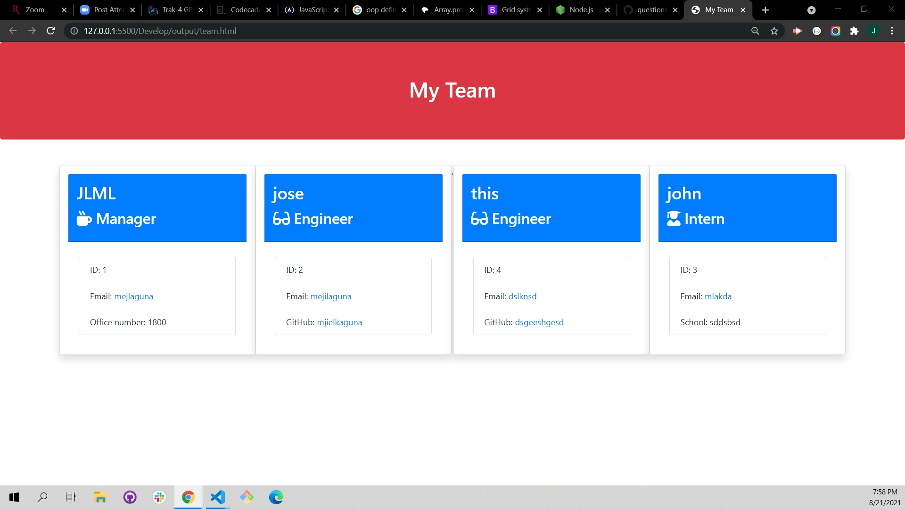
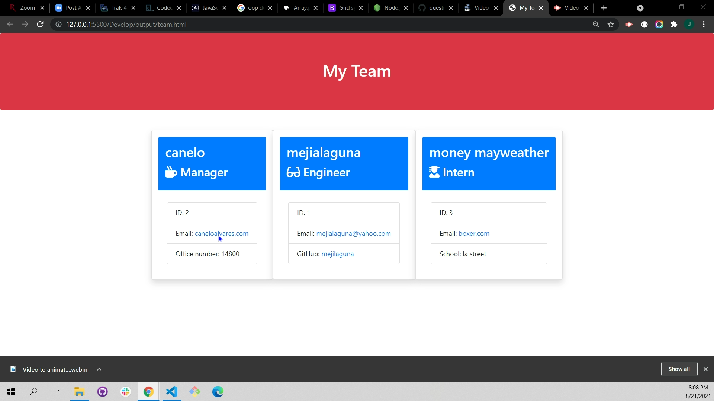

  
  
   
   
  
  

  
  <h1 align="center">Tean-Profile-Generator</h1>
   
  <a href="#about"><strong>Explore the screenshots »</strong></a>
   
   
  
  

  
  
  
  

   
  
  
    
  

  
   
  
  

  
Table of Contents

  
  - [About](#about)
  - [Built With](#built-with)
  - [Installation](#installation)
  - [Authors & contributors](#authors--contributors)
  - [Acknowledgements](#Acknowledgements)
  - [License](#License) 
  
  
  
  
   
  
  ## About
  ---

   
  This application is designed to add and keep track of all the employees inside of a company. 
  
   
   
  

  
Usage Screenshots and Demo

    
  img\gifVideo.webm
  
   
  
  
  
  

  
   
   
  
  
  ## Built With
  ---

   
 >* <a href="https://developer.mozilla.org/en-US/docs/Web/HTML">HTML</a>
 >* <a href="https://getbootstrap.com/">CSS</a>
 >* <a href="https://developer.mozilla.org/en-US/docs/Mozilla/Add-ons/WebExtensions/API">JavaScript</a>
 >* <a href="https://nodejs.org/en/">Node</a>
 >* <a href="https://www.w3schools.com/js/js_es6.asp">ES6</a>
  
  
   
   
  
  ##  Installation
  ---

   
  
   1. Install node js <a href="https://nodejs.org/en/"> [ HERE ]</a>. 
   2. Install Inquirer Dependency <a href="https://www.npmjs.com/package/inquirer">[ Read Documentation here ]</a>.
   3. Clone this <a href="https://github.com/mejialaguna/teamProfileGenerator.git">[ REPO ]</a>.
   4. Run node index inside your terminal. 
   5. Answer all the question. 
   6. Fallow this path Develop/output/team.html , were will be the location if your newly created readme file. 
   7. Enjoy.[ https://mejialaguna.github.io/readmeGenerator/ ]

   
   
  
  
  ##  Authors & contributors
  ---

   
   
  Jose Luis Mejia Laguna.
  
   
   
  
  ## Acknowledgements
  ---

   
  
  First off, thanks for taking the time to check out this app! Contributions are what make the open-source community such an amazing place to learn, inspire, and create. Any contributions you make will benefit everybody else and are greatly appreciated.
  ---

   
   
  
  ## License
  ---
   

  

   

  
  
  <a href="https://github.com/mejialaguna/teamProfileGenerator/issues/1">For any Question please click here...</a>
  